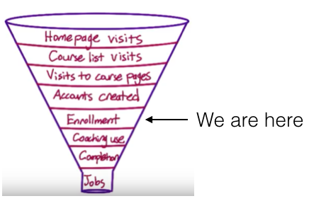

### By Meron Goitom

# A/B-Test: Free Trial Screener

# 1. Experiment Overview

At the time of this experiment, Udacity courses currently have two options on the home page: "start free trial", and "access course materials". If the student clicks "start free trial", they will be asked to enter their credit card information, and then they will be enrolled in a free trial for the paid version of the course. After 14 days, they will automatically be charged unless they cancel first. If the student clicks "access course materials", they will be able to view the videos and take the quizzes for free, but they will not receive coaching support or a verified certificate, and they will not submit their final project for feedback.

In the experiment, Udacity tested a change where if the student clicked "start free trial", they were asked how much time they had available to devote to the course. 

If the student indicated 5 or more hours per week, they would be taken through the checkout process as usual. If they indicated fewer than 5 hours per week, a message would appear indicating that Udacity courses usually require a greater time commitment for successful completion, and suggesting that the student might like to access the course materials for free. At this point, the student would have the option to continue enrolling in the free trial, or access the course materials for free instead. This screenshot shows what the experiment looks like.

The hypothesis was that this might set clearer expectations for students upfront, thus reducing the number of frustrated students who left the free trial because they didn't have enough time—without significantly reducing the number of students to continue past the free trial and eventually complete the course. If this hypothesis held true, Udacity could improve the overall student experience and improve coaches' capacity to support students who are likely to complete the course.

The unit of diversion is a cookie, although if the student enrolls in the free trial, they are tracked by user-id from that point forward. The same user-id cannot enroll in the free trial twice. For users that do not enroll, their user-id is not tracked in the experiment, even if they were signed in when they visited the course overview page.

# 2. Metric Choice
### 2.1 High Level concepts for metrics
###### Overall business objective
- Help students get jobs (What Udacity ultimately cares about)
- Financially sustainable (Need to make money to keep going)

###### Customer funnel

For this experiment, we are at the enrollment part of the funnel.
Any place "unique cookies" are mentioned, the uniqueness is determined by day. (That is, the same cookie visiting on different days would be counted twice.) User-ids are automatically unique since the site does not allow the same user-id to enroll twice.

### 2.2 Matrics choice
- **Number of cookies:** That is, number of unique cookies to view the course overview page. ($d_{min}$=3000)
- **Number of user-ids:** That is, number of users who enroll in the free trial. ($d_{min}$=50)
- **Number of clicks:** That is, number of unique cookies to click the "Start free trial" button (which happens before the free trial screener is trigger). ($d_{min}$=240)
- **Click-through-probability:** That is, number of unique cookies to click the "Start free trial" button divided by number of unique cookies to view the course overview page. ($d_{min}$=0.01)
- **Gross conversion:** That is, number of user-ids to complete checkout and enroll in the free trial divided by number of unique cookies to click the "Start free trial" button. ($d_{min}$= 0.01)
- **Retention:** That is, number of user-ids to remain enrolled past the 14-day boundary (and thus make at least one payment) divided by number of user-ids to complete checkout. ($d_{min}$=0.01)
- **Net conversion:** That is, number of user-ids to remain enrolled past the 14-day boundary (and thus make at least one payment) divided by the number of unique cookies to click the "Start free trial" button. ($d_{min}$= 0.0075)

### 2.3 Invariant metrics
An invariant metric should not change across experimental or control groups. This way we can double-check (sanity-check) the experiment design. If we find significant changes to invariant metrics after the experiment, this could indicate issues with the setup of the experiment. 

The invariant metrics chosen for this experiment are:

- **Number of cookies**
- **Number of clicks**
- **Click-through probability**

The reason being that these metrics are in effect before the pop-up is shown, thus the experiment should have no direct effect on any of the metrics.

What these three invariant metrics have in common is that at the point of the experiment, these metrics have already been passed and thus will not affect the outcome of the experiment.  This means equal distribution amongst the experiment and control groups would be expected since at this point in the funnel the experience is the same for all users.

**Number of cookies:** Approximation of unique visitors to the course overview page. This invariant metric is a population sizing metric.

**Number of Clicks:** The number of unique users to click the "start free trial" button. 

**Click-through-probability:** Unique cookies to click the "start free trial" button divided by the number of unique cookies to view the course overview page.

### 2.4 Evaluation metric

The final goal of the experiment is to *“set clearer expectations for students upfront, thus reducing the number of frustrated students who left the free trial because they didn't have enough time—without significantly reducing the number of students to continue past the free trial and eventually complete the course. If this hypothesis held true, Udacity could improve the overall student experience and improve coaches' capacity to support students who are likely to complete the course.”*

In short we want to decrease the enrollment of unprepared students, leading the gross conversion to decrease, while not negatively effecting number of students who complete the free trial and make a payment, i.e the net conversion should either stay the same or go up.

The evaluation metric is expected to change across experimental or control groups, and minimum difference (dmin) must be observed over the course of the experiment. 

- Retention: The change measure after the 14-day trial between enrolled students and dropouts.
- Gross Conversion: How the pop-up affects the number of completed checkouts.
- Net Conversion: Number of students that stayed after the 14-day free trial divided by total students that clicked "Start free trial" button.

What we expect from this experiment is for the **retention** to increase, as we are hoping for the percentage of user-ids to complete checkout and enroll in the free trial to increase. However for this increase to yield any value for udacity it also means that the **net conversion** also has to increase, as we want the proportion of students that stays past the 14-day free trial (thus make at least one payment) to increases, indicating a higher proportion of prepared student enrolling in the program. Further we expect a decrease in the **gross conversion** as a result of the number of students filtered out by the experiment pop-up.

### 2.5 Left out metric
**Number of user-ids**, that is, the number of users to enroll in the free trial is tracked after enrolling in the free trial and would not have equal distribution between the control and experimental groups thus making it a bad evaluation metric since it could skew the results. It is neither a great invariant metric because the number of users who enroll in the free trial is dependent on the experiment. 

# 3. Measuring Variability
Before the experiment was conducted the following data was gathered by a team at Udacity:

|Label |Baseline Values|
|-------------------|---|
| Unique cookies to view page per day                | 40000|
| Unique cookies to click "Start free trial" per day | 3200 |
| Enrollments per day:                | 660|
| Click-through-probability on "Start free trial" | 0.08 |
| Probability of enrolling, given click               |0.20625|
| Probability of payment, given enroll               | 0.53|
| Probability of payment, given click | 0.1093125 |

Given a sample size of 5000 unique cookies visiting the course overview page we can make an analytical estimate of the standard deviation of each evaluation metric.

We can get the fraction of pageviews in the sample per pageviews in the baseline:
$\frac{5000}{40000} =0.125$. 
Giving us the following distribution:

|Label |Baseline Values| Sample|
|-------------------|---|---|
| Unique cookies to click "Start free trial" | 3200| 400 |
| Enrollment | 660 | 82,5 |

[Calculations in mathematica](Equations/Equations.nb)

The number of clicks and enrollments both follow a binomial distribution. The standard deviation of the normal distribution rates is computed with: $σ = \sqrt(\frac{p(1-p)}{n})$

Where the probability and standard deviation calculated as:

|Evaluation metric                    |p          | Standard deviation|
|-------------------                  |---        | ---               |
| Gross Conversion                    | 0.20625   | 0.0202            |
| Retention                           | 0.53      | 0.0549            |
| Net conversion                      | 0.1093125 | 0.0156            |

[Calculations in mathematica](Equations/Equations.nb)

For gross conversion and net conversion, the analytical standard deviation will likely match the empirical standard deviation as both have the number of cookies as their denominator, which is also our unit of diversion. While for the metric retention, the  analytical standard deviation will likely not match the empirical standard deviation, given that the unit of analysis for retention is user-id, while the unit of diversion for the experiment is cookie.

# 4. Sizing
### 4.1 Choosing Number of Samples given Power
The Bonferroni Correction was not used during the analysis phase. To calculate the number of pageviews required for our experiment we need to know the sample size for each evaluation metric. 

Pageviews required were calculated using an alpha value (type I error) of 0.05 and beta value (type II error) of 0.20.

We know the following information from the problem description.

|Evaluation metric                    |d$_{min}$      |
|-------------------                  |---            |
| Gross Conversion                    | 0.01          |
| Retention                           | 0.01          |
| Net conversion                      | 0.0075        |

Sample size, calculated using Evan's Awesome A/B Tools. With the help of the probability we can now calculate page views for each evaluation metric: 

|Metric|Baseline Conversion|Minimum Detectable Effect|Alpha|1-Beta|Sample size|Clicks/Page view|Pageviews|
|---|---|---|---|---|---|---|---|
| Gross Conversion| 20.625%|1%|5%|80%|25,835|.08|646,450|
| Retention| 53%|1%|5%|80%|39,155|.0165|4,741,212|
| Net Conversion| 10.93%|1%|5%|80%|27,413|.08|685,325|
[Calculations in mathematica](Equations/Equations.nb)

The number of page views required to conduct this experiment is 4.741.212 since it is our largest sample size

### 4.2 Choosing Duration vs. Exposure

Give your reasoning for the faction you chose to divert. How risky do you think this experiment would be for Udacity?

The amount of exposure is based on the risks involved in conducting the experiment. In this case the experiment consists of a pop-up reminder to remind students of the commitment time expected to finish the program. 
This screener constitutes minimal risk to the user as it does not affect existing paying customers, and no sensitive data is collected, or other issues which may put the user in harm. This allows for the possibility of 100% exposure rate which would lead to a calculation of duration to a 119 days long experiment. 

This means that duration would create a new potential risk. 119 days is just too long of an experiment as it presents a potential business risk, such as inefficient use of resources, low conversion rate, oppertunity cost as it does not leave room for further experiments. This means we can choose two paths, 1. lowering the exposure rate thus lowering the duration, eg 60% exposure would mean a duration of 71 days, or consider to eliminating the evaluation metric which require most page views from the experiment, which would also lead to a lower duration. 

For this experiment i choose to eliminating the evaluation metric retention from the experiment and only consider Gross Conversion and Net Conversion as it still allows us to test our hypothesis with net conversion. Now dividing the total number of pageviews 685,325 with the page views per day in the baseline (40 000), given 100% diversion, will now require a 18 day experiment. 

# 5. Analysis
### 5.1 Sanity check
Before we can look at the results to determine what happened in our experiment we have to do sanity checks to make sure that the experiment was run properly. 
Below is a computation of a 95% confidence interval for our invariant metrics

|Invariant Metric|Lower Bound|Upper Bound|Observed|Pass/Fail|
|---|---|---|---|---|
| Number of Cookies| .4988|.5012|.5006|Pass|
| Number of Clicks| .4959|.5041|.5005|Pass|
| Net Conversion|.0812|.0830|.0822|Pass|
Our invariant metrics passes the sanity check, and all appear to be well chosen.

### 5.2 Check for Practical and Statistical Significance
For each evaluation metric (gross conversion, net conversion), we test for statistical and practical significance using a 95% Confidence interval. The minimum detectable effect (dmin) is the smallest difference that we will accept between experimental and control groups. 

|Metric|d$_{min}$|Observed Difference|CI Lower Bound|CI Upper Bound|Result|
|---|---|---|---|---|---|
| Gross Conversion| 0.01|-0.0205|-.0291|-.0120|Statistically and Practically Significant|
| Net Conversion| 0.0075|-0.0048|-0.0116|0.0019|Neither Statistically nor Practically Significant|

### 5.3 Run Sign Test
We can conduct a binomial sign test with 95% Confidence interval to further test our evaluation metrics. Using Graphpad software, day-by-day data is computed to see if there is a positive or negative difference between the experiment and control group for each evaluation metric. 

|Evaluation Metric|Two tailed p-value|Statistically Significant at alpha = .05|
|---|---|---|---|---|---|
| Gross Conversion| 0.0026|Yes|
| Net Conversion| 0.6776|No|

Gross conversion rate has 4 of 23 successes for a two-tailed p-value of 0.0026, indicating statistical significance of gross conversion. Net conversion has 10 of 23 successes and a two-tailed p-value of 0.6776 indicating that net conversion is not statistically significant.

# 6. Conclusion 
### 6.1 Summary
The purpose of this experiment was to improve the overall student experience and improve coaches' capacity to support students who are likely to complete the course, by setting clearer expectations for students upfront, reducing the number of not dedicated students—without significantly reducing the number of students to continue past the free trial and eventually complete the course. 

- **Gross Conversion:** How the pop-up affects the number of completed checkouts.
- **Net Conversion:** Number of students that stayed after the 14-day free trail divided by total students that clicked "Start free trial" button.

This report shows that the effect size tests on the gross conversion is both statistically and practically significant, while net conversion is neither. The results show that gross conversion rate dropped in the experimental group by approximately 2% which is inline with our earlier expectations as those students likely to drop during the 14-day trial would be filtered by the screener thus proving that the screener is effective at reducing total number of students enrolling from initial click. The results also however that net conversion was reduced by 0.5%, an evaluation matrix that was initially expected to increase. This indicates that the screener had a negative effect on the number of students that would continue the course past the 14-day trial. This is a result negatively correlated with our expected results. 

For this study i chose not to use the Bonferonni correction, the method used to limit / control the risk of Type 1 errors in multiple independent metrics comparisons. The main reason for this being that our launch decision is based upon the significance of two metrics rather than just one.

### 6.2 RECOMMENDATION 
The experiment shows that the pop-up reduces the total number of completed checkouts. However the experiments also is shown to have a negative effect on the number of students continuing past the 14-day free trial. Based on these results, i would argue against launch the pop-up, but rather research into other designs of the pop-up which can yield better results.

# 7.  FOLLOW-UP EXPERIMENT: How to Reduce Early Cancellations
Based on the summary and recommendations a logical follow-up experiment would be similar to the experiment just conducted but with an adjustment to the designs of the pop-up which can yield better results. This would mean that the set-up with null hypothesis, unit of diversion, invariant metrics and evaluation metrics would all be the same as before.

My second recommendation would be to design an experiment to see if the reason for the high dropout rate is a result of time commitment, and not something else such as the arrangement of lessons or similar. This could then be tested with different arrangements or design in lessons commonly learnt during the first 14 days to see if the change in dropout rate is rather a result of course material than time requirements. This experiment could then be presented in the following matter:

- **Setup:** Upon enrollment students will either be randomly assigned to a control group in which they will see the same material as before, or an experiment group in which a different arrangement of courses will be presented.
- **Null Hypothesis:** The arrangement of course material will not change the number of students enrolled beyond the 14 day free trial period by a significant amount.
- **Unit of Diversion:** The unit of diversion will be user-id as the change takes place after a student creates an account and enrolls in a course.
- **Invariant Metrics:** The invariant metric will be user-id, since an equal distribution between experiment and control would be expected as a property of the setup.
- **Evaluation Metrics:** The evaluation metric will be Retention. A statistically and practically significant increase in Retention would indicate that the change is successful.

If a statistical and practical significant change in Retention is observed, assuming an acceptable impact on overall Udacity resources, the experiment will be launched.
